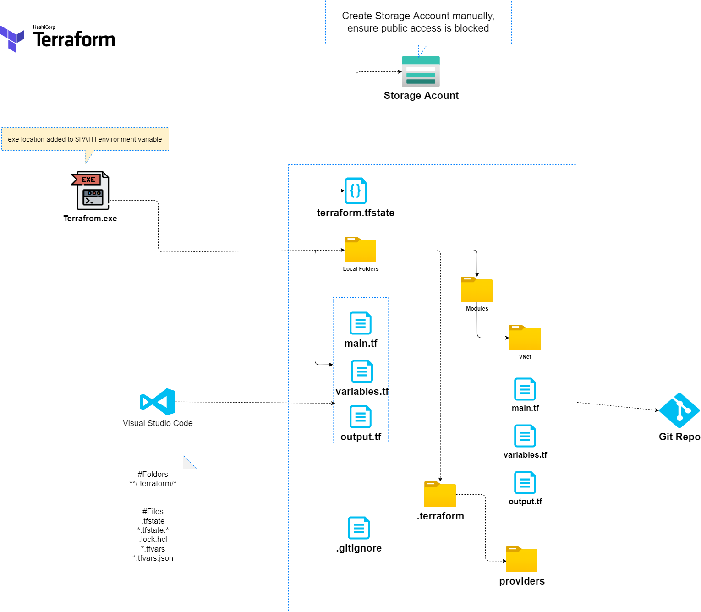

# Overview

This repository contains the following:

- A Terraform 101 list of topics to be considered for the [HashiCorp Terraform Associate Exam](https://www.hashicorp.com/certification/terraform-associate)
- A collection of Terraform deployments and module examples for testing and learning.

# High Level  Overview, Authentication and Backends

# HashiCorp Terraform Associate Exam

## Basics

### Types

- String
- number
- bool
- list (aka tuple), an array, example: ["us-west-1a", "us-west-1c"]
- map (aka object), key value pairs, example: {name = "Mabel", age = 52}

# References

- [Terraform Best practices](https://www.terraform-best-practices.com/) by [Anton Babenko](https://twitter.com/antonbabenko)